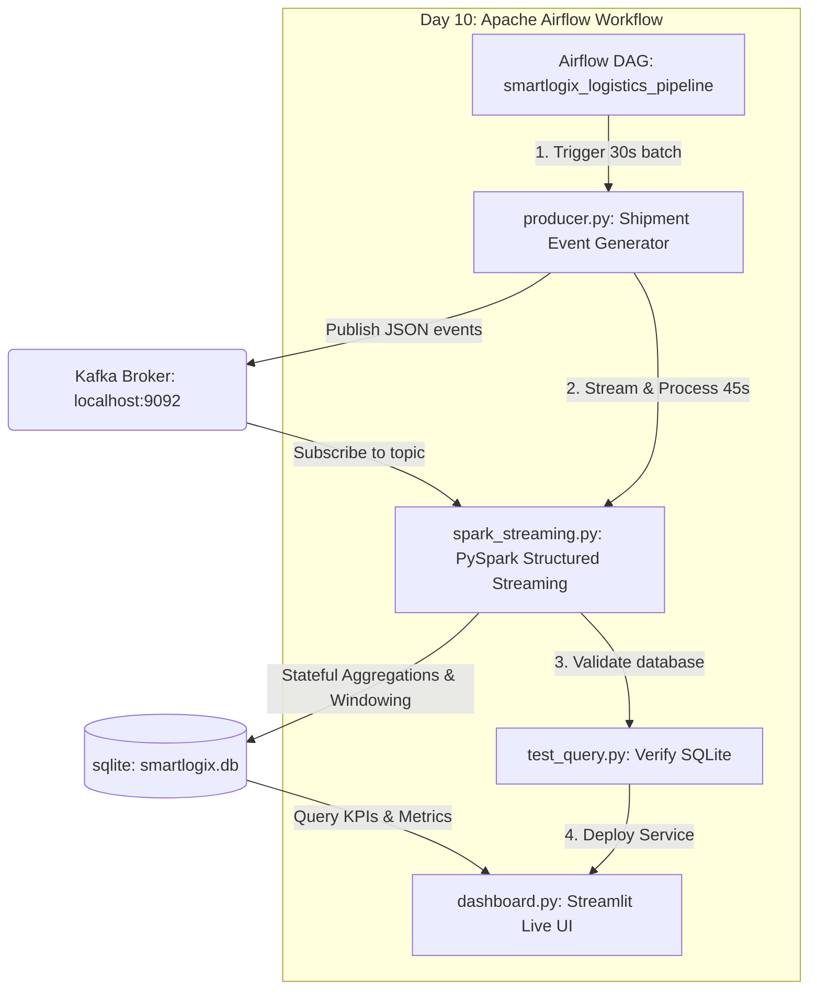

# SmartLogix Live Shipment Analytics Pipeline 🚚

An end-to-end data engineering and analytics solution for real-time logistics tracking. The pipeline leverages **Apache Kafka** for event streaming, **PySpark (Structured Streaming)** for stateful aggregations, **SQLite** as the database backend, and **Streamlit** for live visual analytics.

Workflows can be run either interactively (Day 9 stream processing) or automated using **Apache Airflow** workflow orchestration (Day 10).

---

## 📐 Architecture Overview



---

## 🛠️ Tech Stack & Technologies
* **Message Broker**: Apache Kafka (running in Docker Compose / KRaft mode)
* **Stream Processing**: PySpark Structured Streaming (using local spark-sql-kafka dependencies)
* **Orchestration**: Apache Airflow
* **Database**: SQLite (Thread-locked configuration)
* **Frontend Dashboard**: Streamlit (Dark-themed glassmorphism charts using Plotly)

---

## 🚀 Setup & Installation

### Prerequisites
1. **Docker Desktop** installed and running on your system.
2. **Python 3.8 - 3.11** installed.
3. **PowerShell** (for Windows automation scripts).

### Quickstart Setup
1. Clone this repository (if not already done) and open it as your workspace:
   ```bash
   git clone https://github.com/himanshusar123/smartlogix-analytics.git
   cd smartlogix-analytics
   ```

2. Create and activate a Python virtual environment:
   ```powershell
   # Windows PowerShell
   python -m venv venv
   .\venv\Scripts\Activate.ps1
   ```

3. Install all required dependencies:
   ```powershell
   pip install -r requirements.txt
   ```

4. Make sure Docker is running, then spin up the local Kafka broker:
   ```powershell
   docker compose up -d
   ```

---

## ⚡ Option 1: Live Interactive Pipeline (Day 9)

To run the pipeline interactively, you can use the PowerShell helper script which automatically configures a portable JDK 11 and Hadoop session variables:

```powershell
.\run_pipeline.ps1
```

This starts:
1. **Producer** (`producer.py`): Generates telemetry events continuously.
2. **PySpark Structured Streaming** (`spark_streaming.py`): Processes events from Kafka and writes them to SQLite.
3. **Dashboard** (`dashboard.py`): Streamlit dashboard displaying active shipments, revenue, and high-priority metrics with auto-refresh.

---

## ⏰ Option 2: Workflow Orchestration via Apache Airflow (Day 10)

For enterprise automation, you can run the pipeline under the control of **Apache Airflow**.

### 1. Initialize & Start Airflow
We provide an automated setup script `run_airflow.ps1` that sets up a local database workspace inside the project (`airflow_home/`) so it doesn't pollute your system directories:

```powershell
.\run_airflow.ps1
```

This script will:
* Install `apache-airflow` if it is missing.
* Initialize the SQLite metadata database (`airflow db migrate`).
* Create an administrator account:
  - **Username**: `admin`
  - **Password**: `admin`
* Spawn two terminal instances starting the **Airflow Webserver** (on port `8080`) and the **Airflow Scheduler**.

### 2. Access the Airflow Webserver
Open your browser and navigate to:
👉 **[http://localhost:8080](http://localhost:8080)**

Log in with `admin` / `admin`.

### 3. Run the Automated Pipeline DAG
1. In the DAG list, locate **`smartlogix_logistics_pipeline`**.
2. Click the **Unpause** toggle to activate it.
3. Click the **Trigger DAG** button (play icon) on the top right.
4. Go to the **Graph View** or **Grid View** to watch the sequence execution:
   ```text
   start_producer (30s) ➔ run_spark_streaming (45s) ➔ verify_sqlite ➔ launch_dashboard
   ```
5. Once `launch_dashboard` executes, open the Streamlit dashboard at **[http://localhost:8501](http://localhost:8501)** to view the loaded and verified data.

---

## 📂 Project Structure
```text
smartlogix-analytics/
├── dags/
│   └── shipment_pipeline.py  # Airflow DAG definition (Day 10)
├── hadoop/                   # Portable Winutils folder for PySpark
├── jdk/                      # Portable Eclipse Temurin JDK 11
├── dashboard.py              # Streamlit Web Dashboard
├── docker-compose.yml        # Docker configuration for Apache Kafka
├── producer.py               # Kafka Shipment Event Generator
├── spark_streaming.py        # PySpark stream engine
├── test_query.py             # Database validation script
├── run_pipeline.ps1          # Interactive pipeline launcher
├── run_airflow.ps1           # Airflow orchestration launcher
├── requirements.txt          # Project python package list
└── README.md                 # Project README
```

---

## 💡 Key Design Patterns
* **CLI Graceful Timeouts**: Both the producer and stream processor support CLI limits (`--duration` / `--timeout`) allowing scheduling engines to run finite ingestion/processing batches.
* **Thread-locked SQLite Writes**: Spark's concurrent streaming writers are synchronized via Python `threading.Lock` when writing to `smartlogix.db` to prevent `database is locked` SQLite issues.
* **Detached Dashboard Spawn**: Airflow launches the Streamlit web server in a detached process (`DETACHED_PROCESS` on Windows) so the web app remains running for users, while the DAG execution completes successfully.
